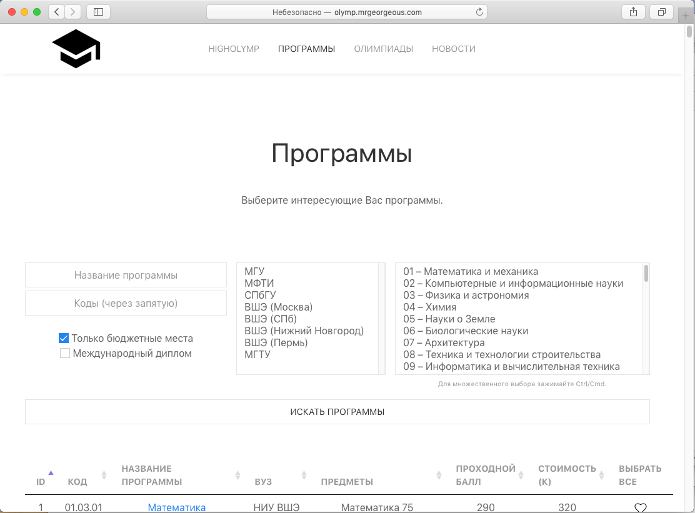

# HighOlymp

Web application to search olympiad privileges in Russian universities.

For further details, see new [data model of 2021](http://github.com/MrGeorgeous/OlympiadAPI).

## Features

* View and search Bachelor's programmes of universities
* See excessive list of accepted olympiads
* Mark favorite programmes
* Mark taken olympiads and search based on these achievements

## Some db specifications

* [Olympiad Profiles](profiles.md)
* [Cities of Russia](towns.md)
* [DB Objects](dbrows.md)

Methods:
* [Olympiad Search](searcher.md)

## Screenshots

